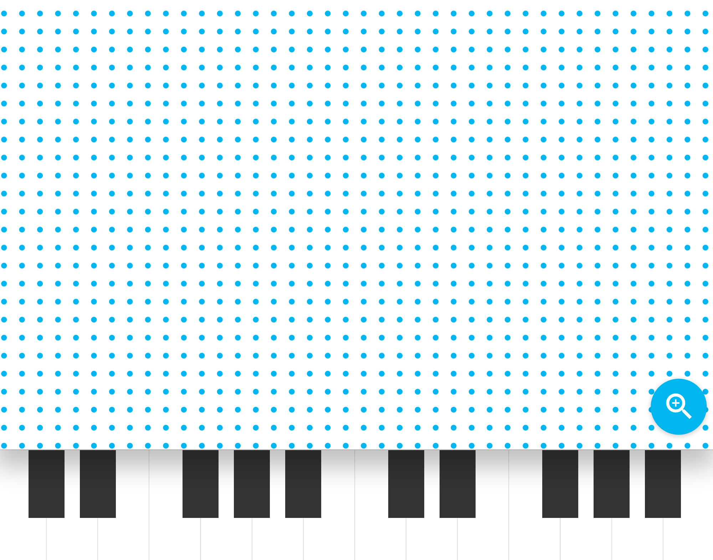

# SoundWaves
- Soundwaves is an audio experiment that attempts to visualise the underlying properties of a sound wave.



The experiments uses [Tone.js](https://github.com/Tonejs/Tone.js) and WebGL.

---

## Prerequisites
- Piano Roll requires node, npm and gulp to build

#### Install gulp
```sh
npm install -g gulp
```

---

## Build and run
1. `npm install` to install all the dependencies
2. `gulp` to build andrun

---

## Exception Handling
- [Installation notes for macOS Catalina (v10.15)](https://github.com/nodejs/node-gyp/blob/master/macOS_Catalina.md)